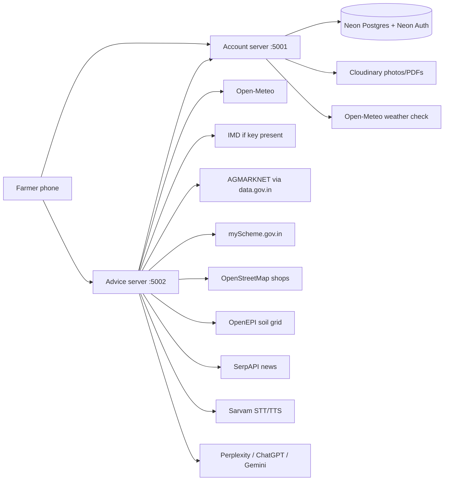
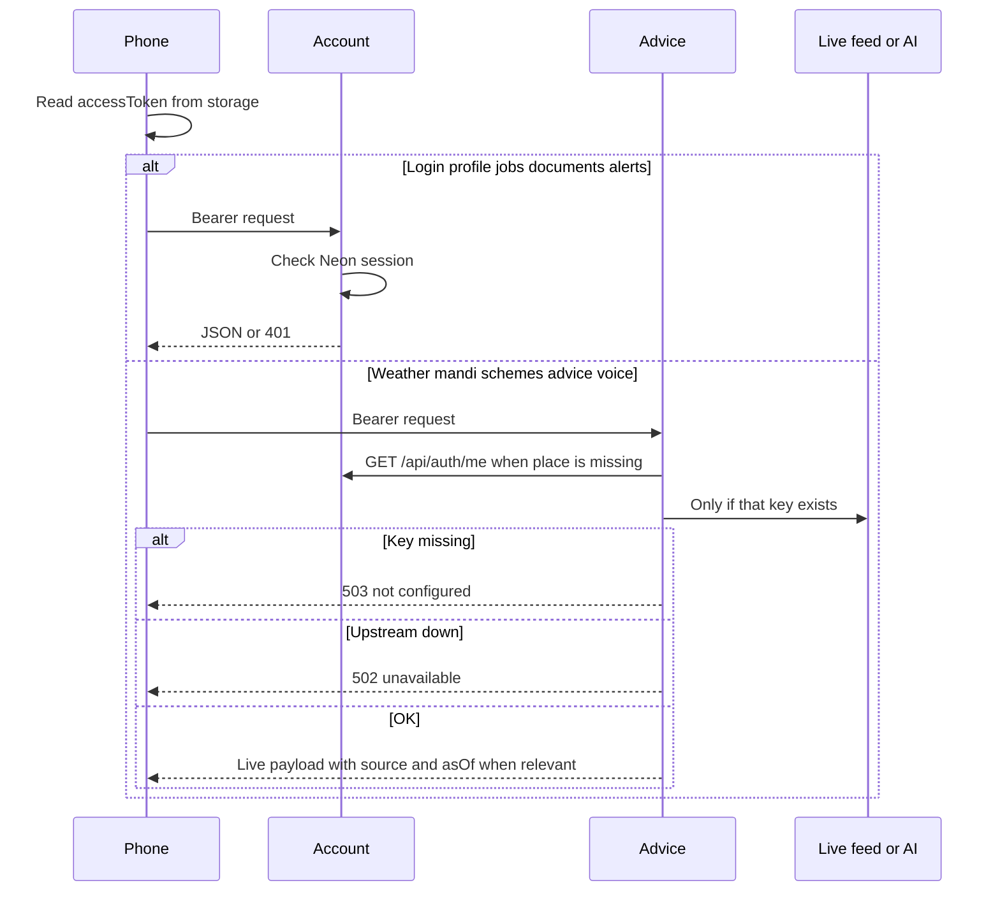

# Nila Shoshsho — current architecture

This file describes the system **as the code works today**. It is not a wish list. The running code is the source of truth.

- Visual / UX system: `DESIGN.md` (tokens, not a live-screen report)
- Future notes, left unchanged: `AGENTIC_AI_STRATEGY_2027.md`, `BACKEND_ELEVATION_PLAN.md`

## What the product does

Nila Shoshsho is a phone companion for Indian farmers. After email sign-in, a farmer can ask for weather, mandi prices, government schemes, fertilizer and crop-window advice, leaf-photo checks, nearby shops, news, documents, and pickup jobs. Advice is in eight UI languages. Voice listen/speak goes through the advice server (Sarvam), not a second vendor.

The phone never holds paid API keys. If a feed or key is missing, the farmer sees an honest error, not sample prices.

## Moving parts

Three processes plus hosted data:

1. **Phone app** (`MobileApp/`) — React Native. Talks to the two servers using `MobileApp/backendConfig.js` (no secrets). Defaults are the Android emulator: account `http://10.0.2.2:5001/api`, advice `http://10.0.2.2:5002`.
2. **Account server** (`backend/`) — Node / Express, default port **5001**. Farmers, login, profile, documents, in-app alerts, logistics jobs. Database is Neon Postgres. Sign-in is Neon Auth email/password. No phone login. No SMS.
3. **Advice server** (`AiBackend/`) — Flask, default port **5002**. Chat, weather, mandi, schemes, crop tools, voice, news. It may call the account server (`ACCOUNT_URL`) to fill the farmer’s saved place when the phone omits lat/lon.

## How a typical request runs

401 on either server means the session is dead. The phone clears storage and sends the farmer to login.

## Account server (port 5001)

| Area | What it does |
| --- | --- |
| Auth | Signup, email login, logout, me, profile, password, profile picture |
| Documents | PDF upload to Cloudinary |
| Notifications | In-app rows. `POST /api/notifications/weather-check` reads Open-Meteo. It stores a row only for heat (≥40°C), cold (≤5°C), or wind (≥50 km/h), and skips the same title on the same UTC day |
| Logistics | Farmer posts a pickup; logistics role accepts and marks done |

`GOV_ID_KEY` scrambles government-ID numbers in the database. The phone receives a masked value (last four characters). Saving a profile does not overwrite a real map point with 0,0.

Run `backend/src/db/schema.sql` once on Neon (or `npm run db:setup`). That also clears leftover farmer phone numbers from older builds.

## Advice server (port 5002)

Every route except `/health` needs a Bearer token.

| Farmer screen | Route | Live source |
| --- | --- | --- |
| Home weather | `GET /weather` | Open-Meteo is the number to trust. IMD chip only when `imd` is present |
| Home search | `GET /search` | Jump-to-tool catalog, not web search |
| Market prices | `GET /api/market-prices` | AGMARKNET via data.gov.in |
| Market compare / insight | `/api/market-compare`, `/market/insights`, `/api/market-analysis` | Same mandi rows. No invented two-week forecast |
| Nearby stores | `GET /stores/nearby` | OpenStreetMap + mandi list |
| Schemes | `POST /govscheme` | myScheme titles/links, or 503 + open myscheme.gov.in |
| Fertilize | `POST /api/fertilizer_recommendation` | Soil Health Card numbers if entered, else OpenEPI grid. Always `soil_source`. **422** if typical soil cannot be read |
| Suggest / calendar | `/crop_suggestion`, `/crop_calendar` | Official month windows + 7-day weather. Crop calendar is also a Home tile |
| Water / post-harvest | `/water_management`, `/postharvest` | Open-Meteo plus advice, not a sensor |
| Leaf scan | `POST /plant-disease` | Gemini vision. Low confidence is 422; ask KVK |
| Chat | `POST /chatbot/ask` | Perplexity / ChatGPT / Gemini, grounded in live feeds when place exists |
| Voice | `/voice/stt`, `/voice/tts` | Sarvam |
| News | `GET /news` | SerpAPI |
| PDF explain | `POST /translate` | Farmer-language explanation, not a certified translation |

Missing keys return **503**. Dead upstream feeds return **502**. News accepts remaining Indian states and short language codes (`en`, `hi`, …). Voice listen should send the real recording type (often `audio/m4a`), not always wav. The phone must not fill those gaps with demo data.

## Phone app

Bottom tabs (route names locked): Home, Scheme, Crop Care, Market, News.

Stack screens include Settings, Profile, Fertilizers, CropSuggestion, WaterManagement, PostHarvest, Documents, Notifications, Logistics, Chatbot.

Voice Seed sits above the tab bar. Speak uses `POST /voice/stt`. Listen uses `POST /voice/tts` and plays audio with `expo-av`. Android needs microphone, camera, and photo permissions in the manifest.

## Keys and env files (servers only)

Advice server (`AiBackend/.env` from `AiBackend/.env.example`):

- `DATA_GOV_API_KEY`, `MYSCHEME_API_KEY`, `SERP_API_KEY`, `SARVAM_API_KEY`
- At least one of `PERPLEXITY_API_KEY` / `OPENAI_API_KEY` / `GEMINI_API_KEY`
- Optional `IMD_API_KEY`
- `NEON_AUTH_JWKS_URL`, `ACCOUNT_URL`, `CORS_ORIGINS`, `FLASK_DEBUG=0`

Account server (`backend/.env` from `backend/.env.example`):

- Neon `DATABASE_URL`, `NEON_AUTH_BASE_URL`, `NEON_AUTH_JWKS_URL`
- `GOV_ID_KEY`, Cloudinary trio
- `PORT`, `NODE_ENV`, `CORS_ORIGINS`

Never put those values in the phone app or in git.

## What is left after the farmer-tool honesty pass

Farmer tools named above are wired to live payloads. A local emulator test still needs keys in the two `.env` files. Public launch still needs:

1. Create/fill the two `.env` files. Do not commit them.
2. Neon project with Auth on. Run `schema.sql` once.
3. Deploy both servers on HTTPS (README mentions Render if you use it).
4. Set `CORS_ORIGINS` if a website will call the servers.
5. Point `MobileApp/backendConfig.js` at those HTTPS addresses for a real phone. Emulator defaults stay `10.0.2.2`.
6. Click through Schemes, Fertilize, Suggest, Market, and Alerts on a signed-in farmer with a saved village.

Not in this launch slice: satellite moisture, device push, offline sync, or the 2027 agent roadmap.

## Documentation map

| File | Role |
| --- | --- |
| `README.md` | How to run, languages, public checklist, screenshots |
| `ARCHITECTURE.md` | This file. Current boxes and arrows |
| `DESIGN.md` | Visual system. Not a live-screen report |
| `MobileApp/README.md` | How to run the phone app. No secrets |
| `MobileApp/components/README.md` | UI pieces that are actually wired |
| `AGENTIC_AI_STRATEGY_2027.md` | Future strategy. Do not treat as the live system |
| `BACKEND_ELEVATION_PLAN.md` | Future backend elevation. Do not treat as the live system |
