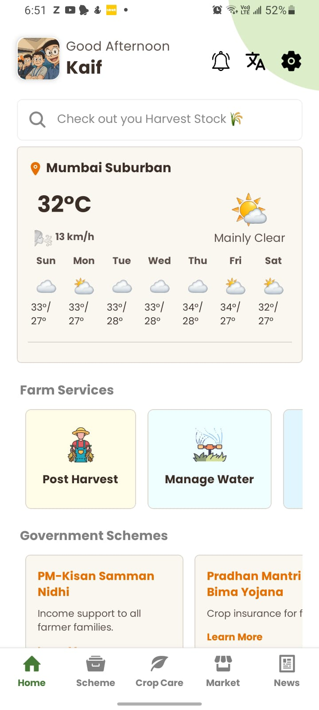
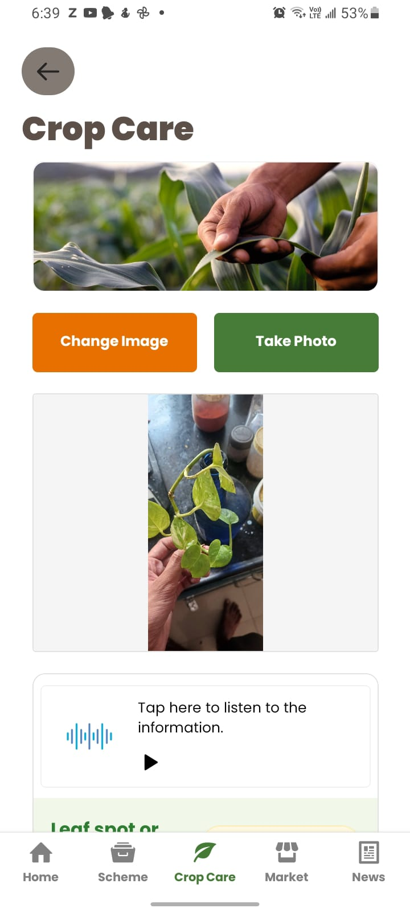
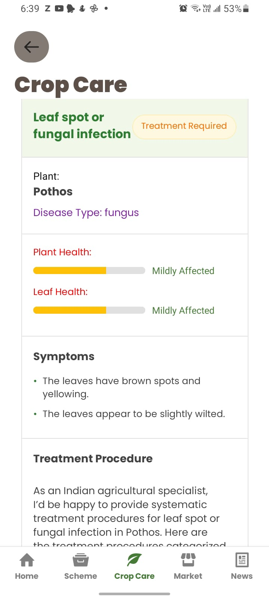
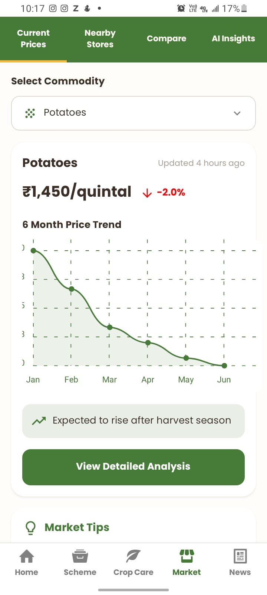
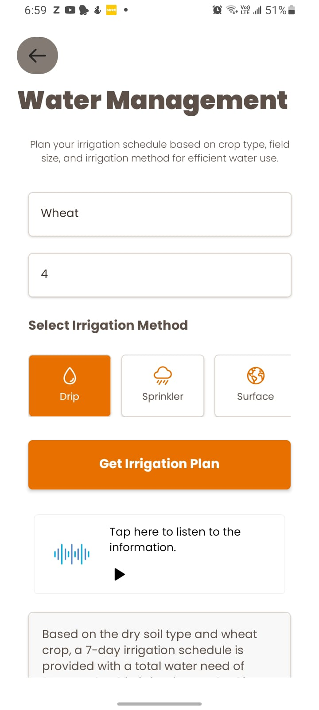
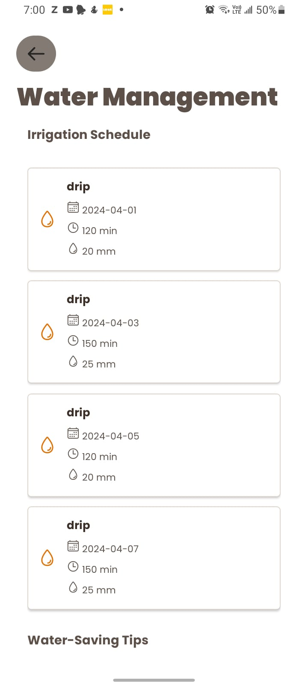
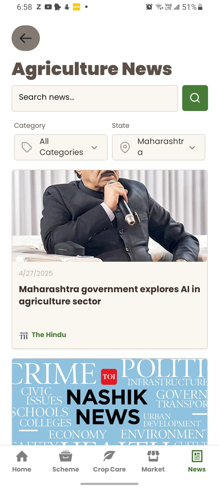
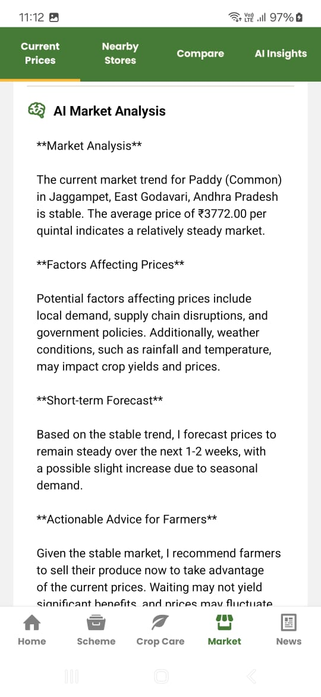
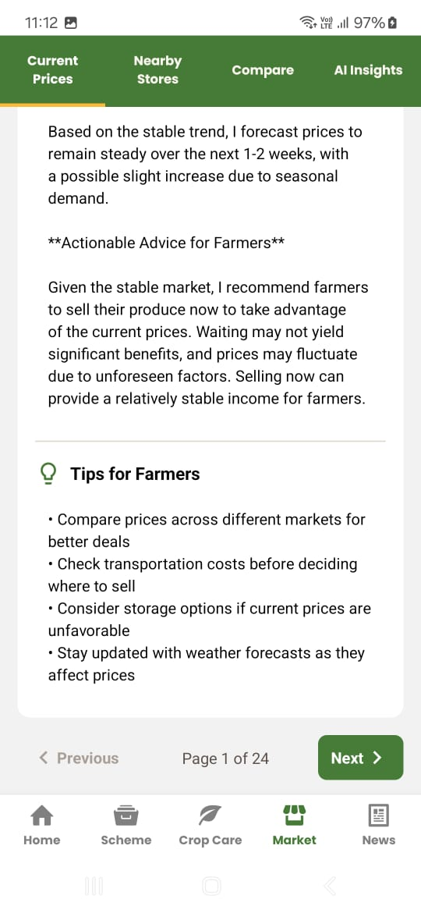

# 🚀 Krishi Setu: Bridging Farmers and AI Technology

> Empowering Indian farmers with AI-driven, localized, multilingual agricultural support.

---

## 📌 Problem Statement

Agriculture forms the backbone of India’s economy, yet smallholder farmers lack access to localized, real-time farming advice, government schemes, and smart market insights.  
**Krishi Setu** addresses this gap with AI-powered, voice-enabled solutions tailored to empower every Indian farmer.

---

## 🎯 Objective

**Goal:**  
- Deliver **personalized crop, weather, and market advice** to farmers in **regional languages**.
- **Simplify access** to **government schemes**, **fertilizer recommendations**, and **post-harvest planning**.
- Use **Groq’s LLMs** for **natural language advisory**, **smart recommendations**, and **document summarization**.

---

## 🧠 Team & Approach

### Team Name:
`Hashcode`

### Team Members

| Name              | GitHub Profile                                                                 | Role                 |
|-------------------|--------------------------------------------------------------------------------|----------------------|
| M.Kaif Qureshi    | [Mkaif-Qureshi](https://github.com/Mkaif-Qureshi)                               | Team Leader          |
| Yash Chhaproo     | [yashcode77](https://github.com/yashcode77)                                     | Frontend Developer   |
| Sarvesh Dongare   | [Sarveshdongare2705](https://github.com/Sarveshdongare2705)                     | Backend Developer    |
| Mohit Patil       | [Mohitpatil344](https://github.com/Mohitpatil344)                               | Documentation        |

---

### Our Approach:

- Focused on real-world impact for rural India.
- Built a multilingual, intuitive UI with **voice navigation**.
- Integrated APIs like **Open Meteo**, **Data.gov.in**, **ISRIC**.
- Used **Groq’s ultra-fast LLMs** for **RAG (Retrieval Augmented Generation)** based dynamic advisory.
- Optimized AI calls to keep app lightweight and affordable for farmers.

---

## 🛠️ Tech Stack

### Core Technologies:

- **Frontend:** React Native, Tailwind CSS
- **Backend:** Python, Flask, Node.js, LangChain
- **Database:** MongoDB
- **Authentication:** OAuth 2.0
- **APIs:** Open Meteo, Data.gov.in, ISRIC Data
- **Hosting:**  Render

---

## ✨ Key Features

- ✅ **Agentic RAG Advisory Chatbot** for farming queries.
- ✅ **Crop Disease Detection** from plant images.
- ✅ **Personalized Fertilizer Recommendations**.
- ✅ **Post-Harvest Planning** with Google Calendar sync.
- ✅ **Smart Market Analysis** (current prices, best selling options).
- ✅ **Week-wise Crop Calendar**.
- ✅ **Multilingual Voice Navigation**.
- ✅ **Government Schemes Summarizer**.
- ✅ **Real-time Weather Forecasts**.

---

- 🎥 **Demo Video Link:** [Watch Here](https://youtu.be/sP0VQ7D3QhQ)

---

## 📱 App Screenshots


<div style="display: flex; justify-content: space-around;">
  
  
  
</div>
<br />
<div style="display: flex; justify-content: space-around;">
  
  
  
</div>
<br />
<div style="display: flex; justify-content: space-around;">
  
  
  
</div>

---

## 🧪 How to Run the Project

### Requirements:

- Node.js v18+
- Python 3.11.0
- MongoDB Atlas or Local
- Groq API Key
- .env configuration file (example provided)

Here's the updated local setup instructions with the corrected folder structure and descriptions for your project:

---

## Local Setup

## Clone the repository

```bash
git clone https://github.com/Mkaif-Qureshi/agriculture
```

## Install dependencies and run the applications

### 1. **Frontend (React Native - Mobile App)**

Navigate to the `MobileApp` folder and install the required dependencies:

```bash
cd MobileApp
npm install
```

Then, start the mobile app:

```bash
npx react-native run-android
```

### 2. **Backend (Node.js)**

Navigate to the `backend` folder and install the Node.js dependencies:

```bash
cd ../backend
npm install
```

Start the backend:

```bash
npm run dev
```

### 3. **AiBackend (Python)**

Navigate to the `AiBackend` folder and install the Python dependencies:

```bash
cd ../AiBackend
pip install -r requirements.txt
```

Run the AI backend:

```bash
flask run
```

---

## 🧬 Future Scope

- 🌾 Satellite-driven soil moisture and crop stress analysis.
- 🌍 Expansion to Bangladesh, Nepal, Sri Lanka (regional adaptations).
- 🔒 Advanced privacy for farmer data via blockchain (future vision).
- 📱 Offline mode support with periodic syncing.

---

## 📎 Resources / Credits

- Open Meteo API (weather)
- ISRIC Soil Data
- Data.gov.in Market API
- Groq LLM Models
- Canva for Workflow Diagrams


---

## 🏁 Final Words

At **Hashcode**, we believe technology should not be a privilege but a bridge for empowerment.  
**Krishi Setu** stands for every farmer, helping them thrive using the power of AI, Groq, and community-driven innovation.

Let's sow the seeds of a smarter tomorrow, together! 🌱🚀

---

# ✨ Thank you! ✨
