# Nila Shoshsho: The soil's bounty, for your dedication

> Empowering Indian farmers with AI-driven, localized, multilingual agricultural companion.

---

## Documentation Index

- [Current architecture](./ARCHITECTURE.md) — boxes, arrows, and what is left to launch
- [Frontend contract](./FRONTEND.md) — live HTTP paths for the phone
- [Design system](./DESIGN.md)
- [Agentic AI Strategy 2027](./AGENTIC_AI_STRATEGY_2027.md) — future notes, not the live system
- [Backend Elevation Plan](./BACKEND_ELEVATION_PLAN.md) — future notes, not the live system

---

##  Our Mission

Agriculture forms the backbone of India’s economy, yet smallholder farmers lack access to localized, real-time farming advice, government schemes, and smart market insights.  
**Nila Shoshsho** addresses this gap with AI-powered, voice-enabled solutions tailored to empower every Indian farmer.

---

##  Objective

**Goal:**  
- Deliver **personalized crop, weather, and market advice** to farmers in **regional languages**.
- **Simplify access** to **government schemes**, **fertilizer recommendations**, and **post-harvest planning**.
- Using **powerful AI** for **natural language advisory, smart recommendations, and document summarization**.

---

### Our Approach:

- Focused on real-world impact for rural India.
- Built a multilingual UI with **read-aloud** on several advice screens (not full voice control).
- Integrated APIs like **Open Meteo**, **Data.gov.in**, and soil lookups.
- Advice uses Perplexity, ChatGPT, and Gemini on the server. Voice uses Sarvam.
- Kept paid API keys on the servers, not inside the phone app.

---

##  Tech Stack

### Core Technologies:

-   **Frontend:** React Native, React Navigation
-   **Backend:** Python, Flask, Node.js
-   **AI Engine:** Perplexity, ChatGPT, Gemini on the advice server. Voice is Sarvam.
-   **Database:** Neon Postgres (Neon Auth for sign-in)
-   **Authentication:** Neon Auth (email/password). No phone login. No SMS.
-   **APIs:** Open Meteo, Data.gov.in, soil property lookup, SerpAPI (news)
-   **Hosting:** Render (if deployed)

---

##  Key Features

-  **Phone app UI** in eight languages, with read-aloud on some advice screens.
-  **Farming chatbot** on the advice server (login required). Perplexity, ChatGPT, or Gemini, grounded in live mandi/weather when the profile has a location.
-  **Crop disease detection:** upload a plant photo for health analysis (advice server).
-  **Fertilizer recommendations** from crop, location, and soil/weather lookups.
-  **Post-harvest planning** as an in-app plan. There is no Google Calendar sync.
-  **Market prices** from data.gov.in, with compare and insights reports on the advice server. Nearby stores come from OpenStreetMap plus mandi lists.
-  **Crop suggest / calendar:** official season windows (not a fake score table), plus a 7-day weather overlay.
-  **Schemes** screen lists myScheme titles and links, or opens myscheme.gov.in if the catalogue is not configured.
-  **Weather** from Open-Meteo and IMD (`GET /weather`) when IMD is reachable.
-  **News** through the advice server (requires a SerpAPI key on that server).

---

## Screenshots
These pictures are older. The live screens may look different. They stay here for now so people can see the product at a glance.
### Home
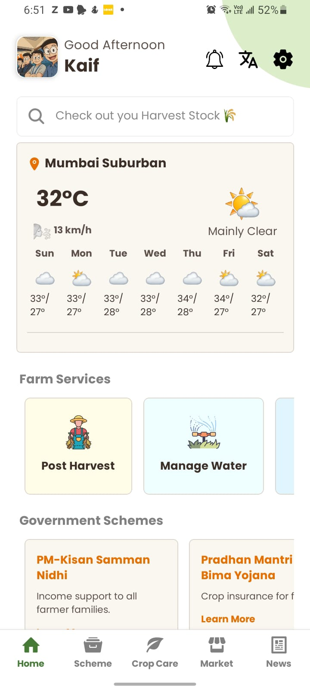
### Crop care
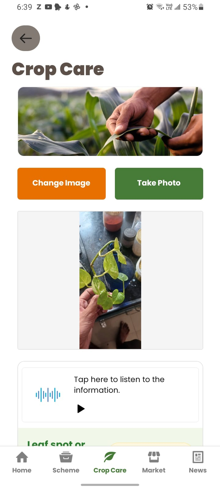
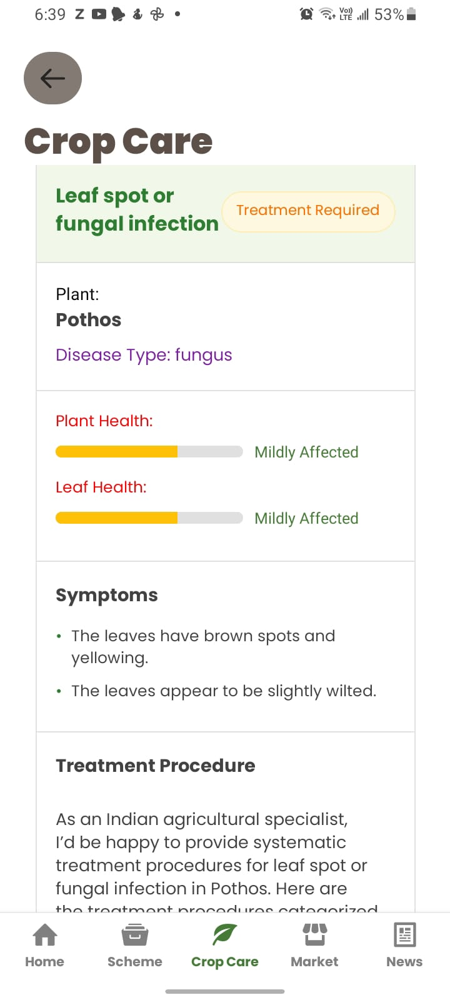
### Post harvest
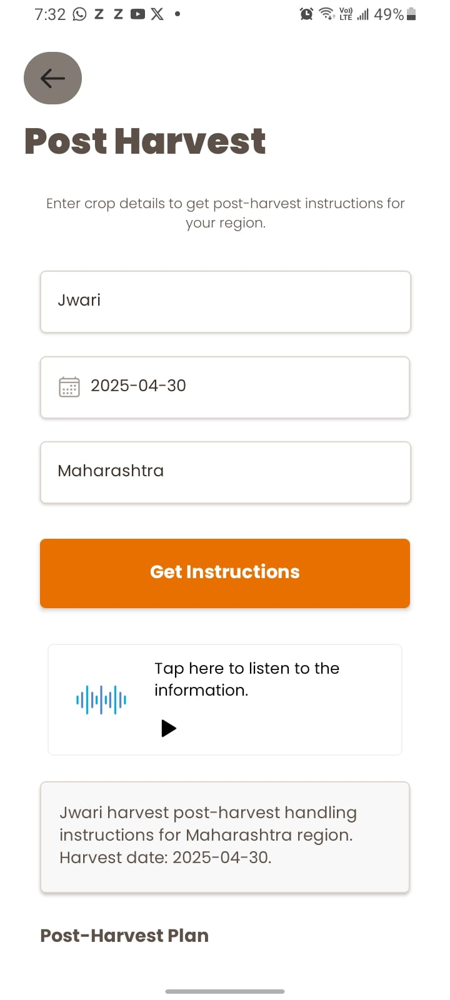
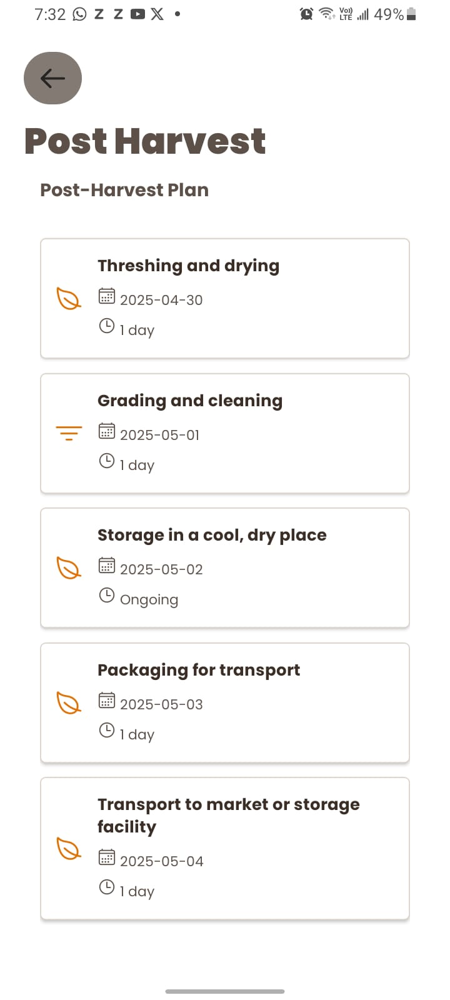
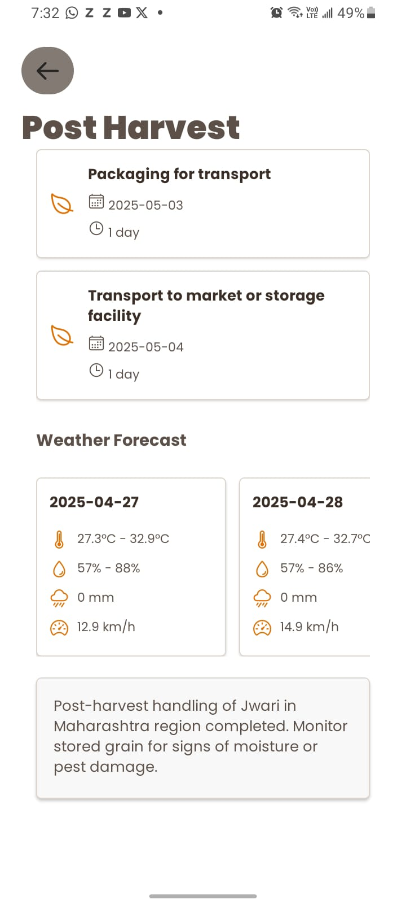
### Market
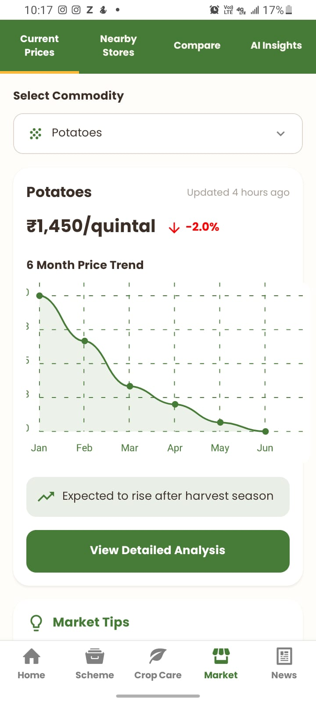
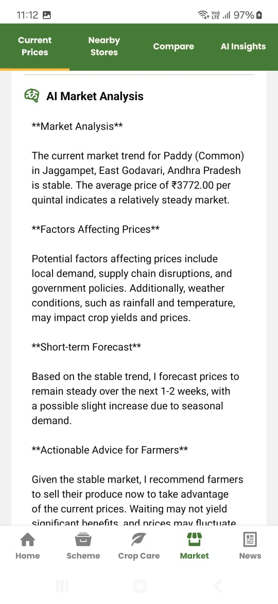
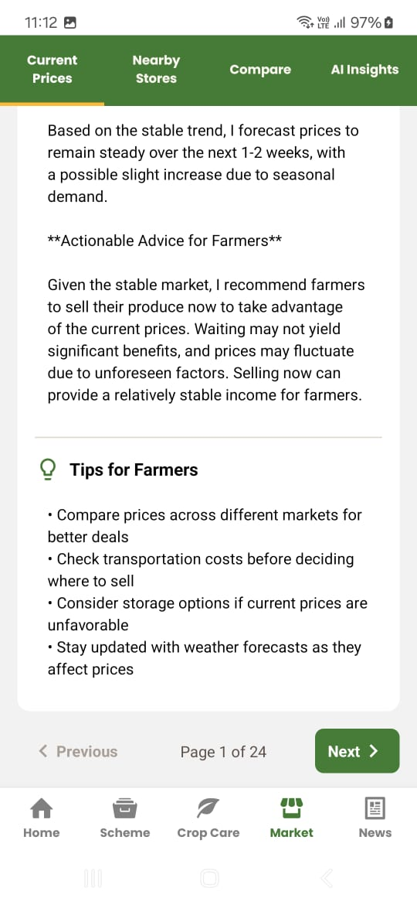
### Water
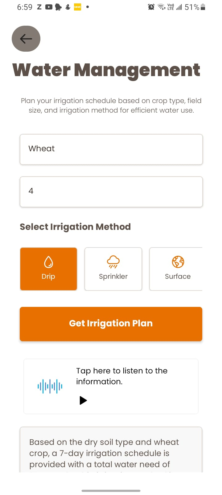
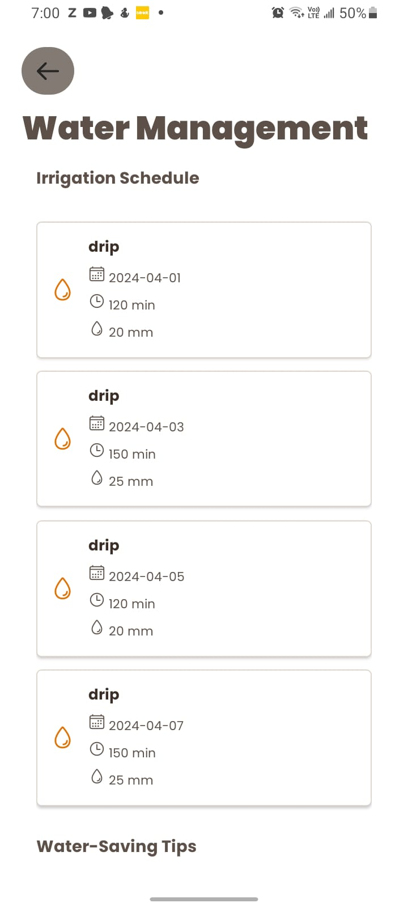
### News
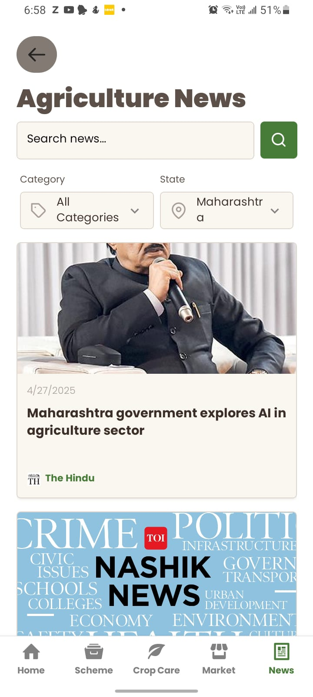
---

##  Supported Languages

Nila Shoshsho supports **8 languages**:

-   English
-   Hindi (हिंदी)
-   Marathi (मराठी)
-   Tamil (தமிழ்)
-   Bengali (বাংলা)
-   Kannada (ಕನ್ನಡ)
-   Telugu (తెలుగు)
-   Malayalam (മലയാളം)

---

##  How to Run the Project

### Requirements:

- Node.js v18+
- Python 3.11.0
- A Neon project with Auth turned on (manual). Copy the database URL, Auth URL, and JWKS URL into `backend/.env`.
- Keys for the **servers only**: SerpAPI, data.gov.in, Perplexity, OpenAI, Gemini, Sarvam, Cloudinary, optional myScheme and IMD. Never put those in the phone app.
- In the Neon SQL editor, run `backend/src/db/schema.sql`.
- Copy `backend/.env.example` to `backend/.env` and `AiBackend/.env.example` to `AiBackend/.env`.
- Set `ACCOUNT_URL` on the advice server to the account server (default `http://127.0.0.1:5001`) so advice can use the farmer's saved location.

Phone server addresses live in `MobileApp/backendConfig.js` (no secrets). The defaults talk to an Android emulator (`10.0.2.2`). Use `localhost` for an iOS simulator, or your computer's LAN IP for a physical phone.

Frontend team: use `FRONTEND.md`. It is the contract for every live route. You do not need to read server source.

## Local Setup

### Clone the repository

```bash
git clone https://github.com/msrishav-28/nila-shoshsho
```

### 1. Phone app (React Native)

```bash
cd MobileApp
npm install
npx react-native run-android
```

### 2. Account server (Node.js)

```bash
cd ../backend
npm install
npm run dev
```

This listens on port 5001 when `PORT` is set from `.env.example`.

### 3. Advice server (Python)

```bash
cd ../AiBackend
pip install -r requirements.txt
python run.py
```

This listens on port 5002.

## Public launch checklist
Keys and a manual HTTPS deploy are required, but they are not the only leftover steps. See [ARCHITECTURE.md](./ARCHITECTURE.md#what-is-left-after-the-farmer-tool-honesty-pass): Neon Auth, `schema.sql` once, `GOV_ID_KEY`, `CORS_ORIGINS`, and pointing the phone at the live HTTPS addresses.
Set `NODE_ENV=production` and `FLASK_DEBUG=0`. Serve only over HTTPS. Keep every key in server env files, never in the phone app.
If a website will call the servers, put its HTTPS addresses in `CORS_ORIGINS`.
Create a government-ID lock key (this scrambles Aadhaar-style numbers in the database so a stolen copy of the table is unreadable):
```bash
node -e "console.log(require('crypto').randomBytes(32).toString('hex'))"
```
Put that value in `backend/.env` as `GOV_ID_KEY`. Do not commit it. The farmer still sees their own number in the app; staff looking at the raw database do not.
After `npm install` in `backend`:
```bash
npm test
npm run loadtest
```
Start both servers first, then run the load test. It knocks on `/health` 200 times. Advice chat without a login token should be refused, not answered. This machine cannot prove Neon login or paid AI answers until those keys are in `.env`.

Advice-server routes (all except `/health` need a login token): `/chatbot/ask`, `/search`, `/stores/nearby`, `/weather`, `/api/market-prices`, `/api/market-compare`, `/api/market-analysis`, `/market/insights`, `/voice/stt`, `/voice/tts`, `/govscheme`, `/plant-disease`, `/api/fertilizer_recommendation`, `/crop_calendar`, `/crop_suggestion`, `/water_management`, `/postharvest`, `/news`, `/translate`. Missing keys return 503, not invented data.

Account-server routes: `/api/auth/signup`, `/login-email`, `/me`, `/update-profile`, `/update-password`, `/api/notifications`, `/api/notifications/weather-check`, `/api/logistics/jobs`, `/api/logistics/jobs/:id/accept`, `/cancel`, `/done`. Sign-in is email and password only. Running `backend/src/db/schema.sql` (or `npm run db:setup`) clears any leftover farmer phone numbers in the database.

---

##  Future Scope

- **Satellite Integration:** Satellite-driven analysis for soil moisture and crop stress.
- Expansion to Bangladesh, Nepal, Sri Lanka (regional adaptations).
- **Blockchain for Data Privacy:** A long-term vision to secure farmer data.
- **Offline Support:** Access critical information even without an active internet connection through periodic syncing.
- **Push Notifications:** Receive timely alerts for market price changes, weather warnings, and crop calendar reminders.
- **Enhanced Personalization:** A user profile section to tailor content based on your specific crops and preferences.
- **Improved Accessibility (a11y):** Full support for screen readers and other assistive technologies.
---

##  Resources / Credits

- Open-Meteo and IMD (weather)
- ISRIC Soil Data
- Data.gov.in Market API
- Sarvam voice, Perplexity, ChatGPT, Gemini
- Canva for Workflow Diagrams


---

##  Final Words

**Nila Shoshsho** stands for every farmer, helping them thrive using live public data and Indian-language voice.

Let's sow the seeds of a smarter tomorrow, together! 

---
